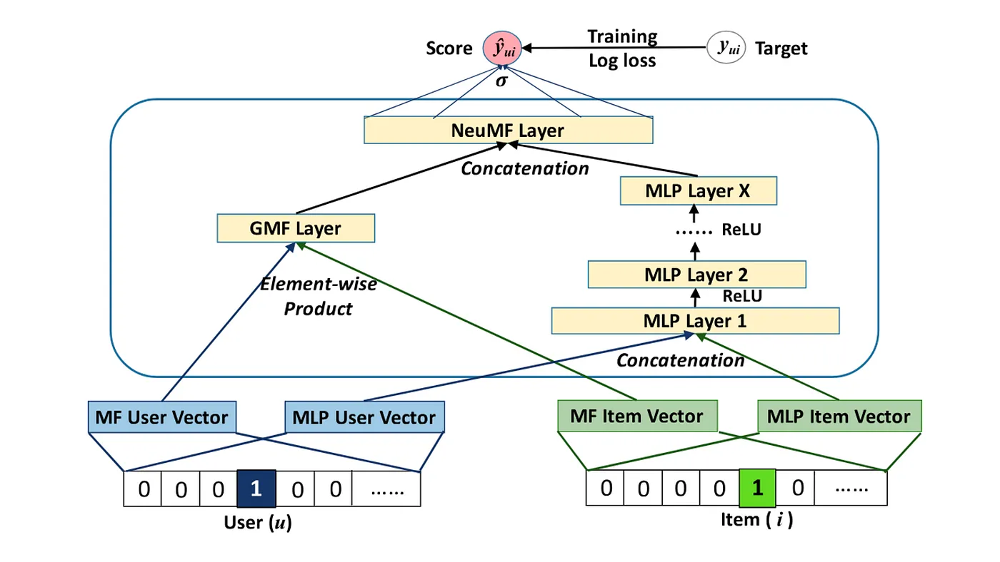

# NCF-BF

Neural Collaborative Filtering

## Neural Collaborative Filterting(NCF) 알고리즘이란?

- 전통적인 협업 필터링 기법은 주로 행렬분해에 기반을 두고 있다. 이러한 기법들은 사용자-아이템 상호작용을 행렬 형태로 표현한 후 이 행렬을 두 개 이상의 행렬로 **분해**하여 평점이나 선호도를 예측하는 방식으로 동작한다.

- 2017년에 제안된 Neural Collaborative Filtering(NCF) 알고리즘은 이러한 접근 방식에 신경망을 결합하여 성능을 높혔다. 행렬분해 모델에 비선형 함수를 통합하여 NCF는 사용자-아이템 상호작용간 복잡한 구조를 표현함으로써, 행렬분해 기법의 선형결합 한계를 극복할 수 있게 되었다.

## NCF 모델의 주요 구성 요소

1. **일반화 행렬 인수분해(Generalized Matrix Factorization, GMF)**
    - 전통적인 행렬 인수분해 방법을 사용한다.
    - 사용자-아이템 상호작용의 선형구조를 표현한다.

2. **다층 퍼셉트론(Multi-Layer Perceptron, MLP)**
    - 여러개의 Layer로 더 복잡한 구조인 비선형성 구조를 학습한다.

## 모델 프레임워크

### Generalizaed Matrix Factorization(GMF) Layer

$\hat{r} = a(w(q(*)p))$

- a : 활성화 함수
- w : 가중치
- q,p : 각각 사용자와 상품의 임베딩 벡터
- 여기서, 활성화 함수(a)를 Identity matrix와 가중치(w)를 값이 1인 벡터로 가정하면, MF 모델과 완정히 동일하다.

### Multi-Layer Perceptron(MLP) Layer

$\hat{r} = a(wx + b)$

- a : 활성화 함수
- w : 가중치
- x : 사용자와 상품이 합쳐진 임베딩
- b : biases
- 사용자와 삼품 두개의 임베딩 레이어를 가로로 붙여 하나의 임베딩 레이어로 생성
- perceptron은 기복적으로 $y = a(wx + b)$의 모델이기에 동일하게 임베딩레이어의 weight matrix, bias vector, activation function이 layer 별로 각각 필요하다.
- 활성화 함수로는 tanh, relu, sigmoid 등 선택이 가능하다.

### Fusion of GMF and MLP Layer

- 두 모델을 결합하기 위하여 두 레이어를 Concatenate하고 출력 레이어는 0 또는 1로 예측하기 위하여 Sigmoid 레이어를 사용한다.