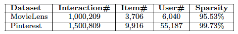

# NCF-BF

Neural Collaborative Filtering

## Neural Collaborative Filterting(NCF) 논문 라뷰

### Introduction

- 기존 추천시스템 연구는 Collaborative Filtering에 기반한 Matrix Factorization 관련 연구가 주류였다. 그러나 단순 inner-product는 explicit 데이터의 linear한 관계만을 표현한다는 한계가 있다. 딥러닝을 추천시스템에 적용한 연구들이 있었지만, inplicit한 user interaction data와 복잡한 latent feature를 반영하기에는 한계가 있었다.

- 본 논문은 user-item 간의 implicit 정보를 활용하여 user preference를 더 잘 표현하고자 한다. 이를 위해 Matrix Factorization 기반 GMF 모델과 Neural Network 기반 MLP 모델을 결합한 NCF 프레임워크를 제안한다.

### Preliminaries

#### Learning from implicit data

- 추천 시스템에서 user와 item의 관계는 Explicit/Implicit한 데이터로 표현된다. Explicit data는 평점, 좋아요와 같이 고객이 아이템에 대해 직접 선호도를 평가한 명시적 데이터이다.

- 반면, Implicit data는 시청 시간, 로그 기록과 같이 묵시적으로 나타나는 데이터이다.

- 본 논문에서는 user와 item간의 implicit data를 통해 latent feature를 학습하고자 한다. 이를 위해 평점 여부를 0 or 1로 표현한다.

#### Matrix Factorization

- 선행 연구로 MF에 관한 지식이 필요하다.

- Matrix Factorization Techniques for Recommender Systems (2009)

- 논문 링크 : <https://datajobs.com/data-science-repo/Recommender-Systems-%5BNetflix%5D.pdf>

#### Neural Collaborative Filtering

- 논문에서 제시하는 new neural matrix factorization model은 MF와 MLP의 앙상블이다. 따라서 MF의 linearity와 MLP의 non-linearity의 장점을 동시에 활용할 수 있다.

##### General Framework

- 제안하는 프레임워크는 입력으로는 user와 item의 binary Identity 만을 one-hot encoding한 sparse vector로 활용한다.

- 각 input layer는 embedding layer를 통과하여 dense vector로 임베딩 된다. 이후 본 논문에서 명명한 neural collaborative filtering layers를 지나 최종 prediction scores를 도출한다.

- NCF에서 Multi-layer-representation을 적용하기 위한 모델 그림은 위와 같다. 모델은 user-item interaction인 $y_{ui}$를 예측하기 위해 각 layer의 출력이 다음 layer의 입력으로 활용된다. user와 item은 one-hot encoding하여 입력 데이터로 활용한다.

- 입력 데이터는 임베딩 레이어와 fully connected 레이어를 거치게 된다. 각 neural CF layer는 특정한 latent structures를 발견하기 위해 커스터마이징 할 수 있다. NCF의 prediction model의 fomulation은 다음과 같다.

$$\hat{y}_{ui} = f(P^{T}v^{U}_{u},Q^{T}v^{I}_{i}|P,Q,\Theta_{f})$$

- $P \in \mathbb{R}^{M \times k}, Q \in \mathbb{R}^{N \times k}$는 각각 user와 item의 latent fator matrix를 의미한다. $\Theta_{f}$는 모델 파라미터이다.

$$f(P^{T}v^{U}_{u},Q^{T}v^{I}_{i}) = \phi_{\text{out}}(\phi_{X}(\ldots \phi_{2}(\phi_{1}(P^{T}v^{U}_{u},Q^{T}v^{I}_{i}))\ldots))$$

- $\phi_{text{out}}, \phi_{x}$는 각각 output layer, x-th CF layer의 mapping function을 의미한다.

##### Learning NCF

- 모델이 학습하는 objective function은 아래와 같다. NCF는 아래 식을 최소화하는 방향으로 학습을 진행하며 SGD기법을 활용한다. 목적 함수는 binary cross-entropy log loss 식과 같으며 학습에는 negative sampling($y^{-}$)을 적용한 것을 알 수 있다.

$$L=-\sum_{(u,i)\in y} log \hat{y}_{ui} - \sum_{(u,j)\in y^{-}} log(1-\hat{y}_{ui} = - \sum_{(u,i)\in y \cup y^{-}} y_{ui} log \hat{y}_{ui} + (1-y_{ui})log(1-\hat{y}_{ui})$$

##### Generalized Matrix Factorization(GMF)

- 저자들은 MF를 위 NCF 모델의 special case라고 한다. user latent vector $p_u$를 $P^{T}v^{U}_{u}$로 표현하고 item latent vector 역시 마찬가지로 표현한다. 따라서 first neural CF layer는 다음과 같다. 둘 간의 element-wise product를 진행한다.

$$\phi_{1} (p_{u},q_{i}) = p_{u} \bigodot q_{i}$$

- Output layer 식은 아래와 같다.

$$\hat{y}_{ui} = a_{text{out}} (h^{T} (p_{u} \bigodot q_{i}))$$

- $a_{out}$은 activation function, $h$는 weight를 의미한다. 이때 $a_{text{out}}$으로 identity function, $h$를 uniform vector of 1 이라면 위 식은 정확히 MF 모델로 표현된다. 본 연구에서는 activation으로 sigmoid를 사용하여 non-linear한 표현이 가능하게 했다. 이 부분을 GMF라고 명명하고 있다.

##### Multi-Layer Perceptron(MLP)

- MLP는 user와 item feature를 two path로 concatenation한다. 그러나 단순 concat은 latent feature의 interaction을 충분히 반영하지 못하기 때문에 여러 hidden layer를 통해 모델에 높은 유연성과 비선형성을 부여한다. 아래 식과 같이 MLP는 layer 수 만큼 activation 함수를 통과시킨다. 식에서 $W_{x}$는 가중치 매트릭스, $b_{x}$는 bias, $a_{x}$는 활성 함수를 뜻하고 ReLU를 사용한다. 식은 일반적인 딥러닝의 MLP구조와 같다.

$$z_{1} = \phi (p_{u}, q_{i}) = \begin{bmatrix} p_{u} \newline q_{i} \end{bmatrix}$$

$$\phi_{L} (z_{L-1}) = a_{L}(W^{T}_{L} z_{L-1} +b_{2})$$

$$\hat{y}_{ui} = \theta (h^{T} \phi_{L} (z_{L-1}))$$

##### Fusion if GMF and MLP

- 최종적으로 제안하는 NeuMF 모델이다. 앞서 언급한 것과 같이 GMF와 MLP를 합친 모델이다. 이러한 앙상블 모델을 통해 linearity와 non-linearity의 장점을 동시에 활용할 수 있다. 본 연구에서는 input data로 user와 item one-hot encoding 벡터를 임베딩 레이어에 통과시킨 후 사용한다. 이 때, 두 모델이 같은 임베딩 레이어를 공유할 수도 있지만, 두 장점을 동시에 고려하기 위해 임베딩 역시 각각 진행한다.

- user와 item one-hot encoding vector를 GMF, MLP 각각 임베딩을 시킨 후 각각 Layer들을 통과하며 학습을 진행한다. 이후 최종적으로 두 벡터를 concat한 후에 NeuMF Layer를 통과하여 최종 $\hat{y}_{ui}$를 예측하고 Log loss function을 통해 학습을 진행한다. 이때 효율적인 학습을 위해 (Local minimum에 빠지지 않기 위해) GMF, MLP 각각 pre-trained으로 학습된 두 벡터를 concat하여 NeuMF Layer를 학습한다. pretraining은 Adam, NeuMF는 SGD 옵티마이저를 사용한다.

$$\phi^{\text{GMF}} = p^{G}_{u} \bigodot q^{G}_{i},$$

$$\phi^{\text{MLP}} = a_{L} (W^{T}_{L} (a_{L-1} (\ldots a_{2} (W^{T}_{2} \begin{bmatrix} p^{M}_{u} \newline q^{M}_{i} \end{bmatrix} + b_{2})\ldots)) + b_{L}),$$

$$\hat{y}_{ui} = \theta (h^{T} \begin{bmatrix} \phi^{\text{GMF}} \newline \phi^{\text{MLP}} \end{bmatrix}),$$

    - $p^{G}_{u}$ : User embedding for GMF
    - $p^{M}_{u}$ : User embedding for MLP
    - $q^{G}_{i}$ : Item embedding for GMF
    - $q^{M}_{i}$ : Item embedding for MLP

### Experiments

- 논문에서 해결하고자 하는 research question은 아래와 같다.
    - RQ1. Do our proposed NCF methods outperform the state-of-the-art implicit collaborative  ltering methods?
    - RQ2. How does our proposed optimization framework (log loss with negative sampling) work for the recommen dation task?
    - RQ3. Are deeper layers of hidden units helpful for learning from user-item interaction data?

- 데이터셋은 movielens와 pinterest 데이터를 사용한다.